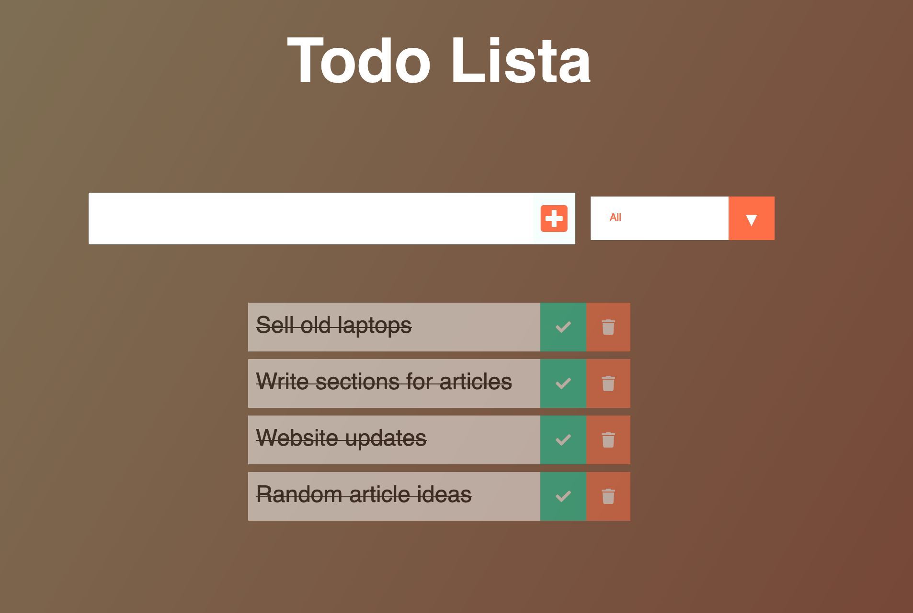
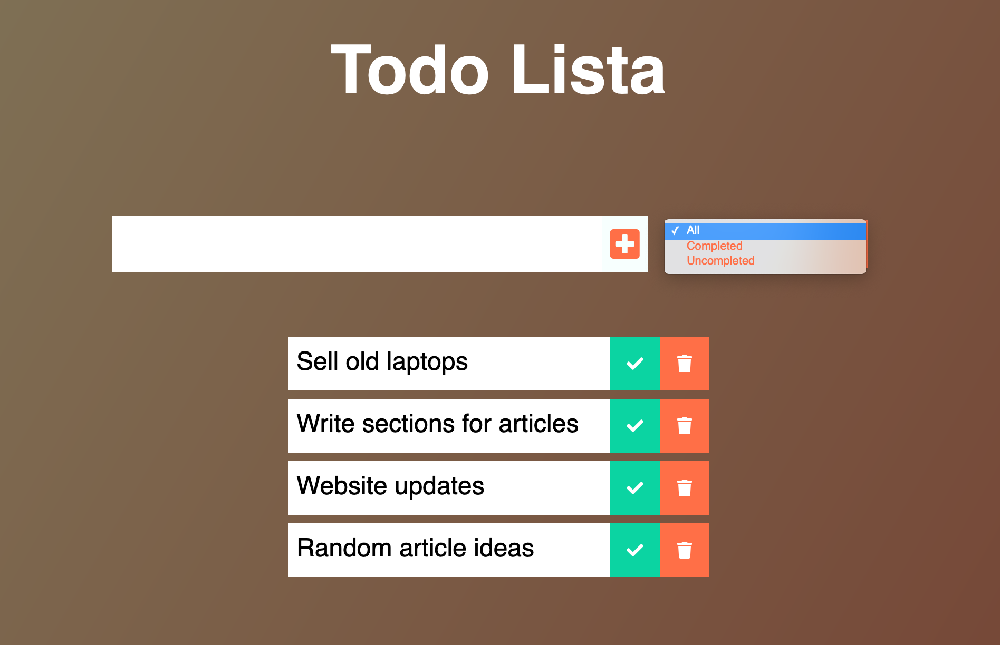

# To Do Lista

## Table of contents
* [General info](#general-info)
* [Technologies](#technologies)

  

  

  

## General info
To do lista: project created creating vanilla JS.

## Technologies
Project is created with:
* JavaScript
* CSS3
* HTML5
